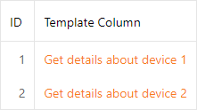

<!-- default badges list -->

<!-- default badges end -->
# ASP.NET - Create a DataItemTemplate for an ASPxGridView Сolumn at Runtime

This example demonstrates how to create a [column cell template](https://docs.devexpress.com/AspNet/DevExpress.Web.GridViewDataColumn.DataItemTemplate) at runtime. Grid cells display the [ASPxHyperLink](https://docs.devexpress.com/AspNet/DevExpress.Web.ASPxHyperLink) control created in the template.

<!-- default file list -->
## Files to look at:

* [Default.aspx](./CS/HyperlinkColumn/Default.aspx) (VB: [Default.aspx](./VB/HyperlinkColumn/Default.aspx))
* [Default.aspx.cs](./CS/HyperlinkColumn/Default.aspx.cs) (VB: [Default.aspx.vb](./VB/HyperlinkColumn/Default.aspx.vb))
* [details.aspx](./CS/HyperlinkColumn/details.aspx) (VB: [details.aspx](./VB/HyperlinkColumn/details.aspx))
* [details.aspx.cs](./CS/HyperlinkColumn/details.aspx.cs) (VB: [details.aspx.vb](./VB/HyperlinkColumn/details.aspx.vb))
<!-- default file list end -->

## Implementation Details

Declare a custom class that implements the [ITemplate](https://docs.microsoft.com/en-us/dotnet/api/system.web.ui.itemplate) interface.

In the class's [InstantiateIn](https://docs.microsoft.com/ru-ru/dotnet/api/system.web.ui.itemplate.instantiatein) method, create controls that will make up the template and add them to the [control collection](https://docs.microsoft.com/ru-ru/dotnet/api/system.windows.forms.control.controls) of a container passed as this method's parameter. A container type is different for each template type. For the [DataItemTemplate](https://docs.devexpress.com/AspNet/DevExpress.Web.GridViewDataColumn.DataItemTemplate), the container is a [GridViewDataItemTemplateContainer](https://docs.devexpress.com/AspNet/DevExpress.Web.GridViewDataItemTemplateContainer). Use the container's properties to obtain a row's information. For example, use the **KeyValue** property to get a row key (`container.KeyValue`).

Create an instance of the template class and assign it to the column's [DataItemTemplate](https://docs.devexpress.com/AspNet/DevExpress.Web.GridViewDataColumn.DataItemTemplate) property.

## Documentation

[How to: Create Edit Form Template at Runtime](https://docs.devexpress.com/AspNet/4341/components/grid-view/examples/how-to-create-edit-form-template-at-runtime)

## More Examples

* [How to: Create Edit Form Templates Dynamically](https://github.com/DevExpress-Examples/how-to-create-edit-form-templates-dynamically-e986)

* [How to: Implement a Dynamical DataItem Template for Several Same-type Columns](https://github.com/DevExpress-Examples/how-to-implement-a-dynamical-dataitem-template-for-several-same-type-columns-e4020)